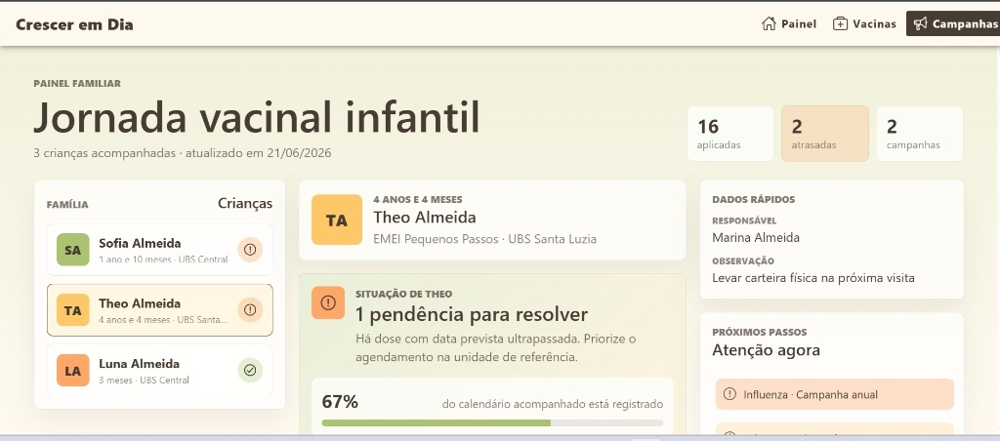

# Crescer em Dia 👶💉
> Plataforma de acompanhamento da jornada de vacinação infantil — Desafio Técnico Cyrrus


<p align="center">
  
</p>

---

## 🎯 Sobre o Projeto

O **Crescer em Dia** é o primeiro módulo de uma plataforma voltada à saúde infantil, desenvolvido com o objetivo de substituir parte da dependência da carteira física de vacinação e empoderar pais e responsáveis no acompanhamento vacinal de suas crianças.

Projeto desenvolvido como requisito para a vaga de Estágio em Desenvolvimento na **Cyrrus**.

---

## ✅ Atendimento dos Cenários Propostos

A arquitetura de informação e a UI foram projetadas para resolver visualmente os 4 cenários exigidos pelo desafio:

1. **Cenário 1 (Vacinas Previstas):** Através do painel individual, o usuário distingue instantaneamente as doses já aplicadas das que estão no calendário previsto.
2. **Cenário 2 (Atrasos/Pendências):** Sistema de alerta visual em destaque (exemplo prático implementado na criança *Theo*), sinalizando o grau de urgência para o agendamento na UBS de referência.
3. **Cenário 3 (Campanhas Ativas):** Módulo fixo de "Atenção Agora", exibindo campanhas sazonais e públicas direcionadas ao público infantil.
4. **Cenário 4 (Famílias Multi-filhos):** Navegação lateral por "Tabs Familiares". Permite que o responsável alterne entre os filhos com um clique, isolando totalmente o contexto, histórico e o percentual de conclusão de cada criança.

---

## 🎨 Design e Decisões de UX

A interface foi construída seguindo rigorosamente a paleta de cores oficial fornecida:

* `#ABC270` — Verde (Utilizado para status de sucesso e vacinas em dia).
* `#FEC868` — Amarelo (Utilizado para a navegação dos cards).
* `#FDA769` — Laranja (Utilizado para sinalização de pendências e campanhas).
* `#473C33` — Marrom Escuro (Utilizado para tipografia de alta legibilidade).

**Foco em "Scannability":** Como o público-alvo são pais e mães com rotinas agitadas, a tela dispensa a necessidade de leitura densa. O usuário entende a saúde vacinal da família apenas batendo o olho nos blocos de cor.

---

## 💻 Decisões Técnicas & Arquitetura

* **Separação de Responsabilidades (Services):** Toda a lógica de verificação de datas, cálculo de dias para vencer e manipulação de objetos `Date` foi isolada no `VaccinationDataService`, deixando os componentes visuais limpos.
* **Orientação a Objetos e Tipagem:** Uso estrito de *Interfaces* e *Models* do TypeScript para garantir a integridade do registro de cada vacina.
* **Componentização:** Divisão estratégica da interface em pequenos componentes reutilizáveis (Headers, Cards de Alerta, Resumos estáticos).

---

## 🔥 Integração com Firebase / Firestore

- **Firebase Firestore** integrado como banco de dados para persistência das campanhas de vacinação, atendendo ao diferencial proposto no desafio.
- Configuração via `provideFirebaseApp` e `provideFirestore` no `main.ts`, seguindo o padrão standalone do Angular 21.
- As campanhas são carregadas em tempo real via `collectionData`, usando Signals do Angular para reatividade.

---

## 🚀 Deploy

A aplicação está publicada e disponível em:

🔗 **[cyrrus-desafio-vacina-infantil.vercel.app](https://cyrrus-desafio-vacina-infantil.vercel.app/)**

---


## 🚀 Como executar o projeto localmente

### Pré-requisitos
* Node.js (v20+ recomendado)
* `pnpm` instalado (`npm install -g pnpm`)

```bash
# 1. Clone este repositório
git clone [https://github.com/Pedro142P4/cyrrus-desafio-vacina-infantil.git](https://github.com/Pedro142P4/cyrrus-desafio-vacina-infantil.git)

# 2. Acesse a pasta do projeto
cd cyrrus-desafio-vacina-infantil

# 3. Instale as dependências
pnpm install

# 4. Execute a aplicação em modo de desenvolvimento
pnpm start